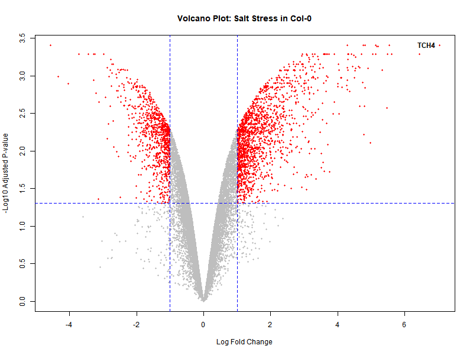
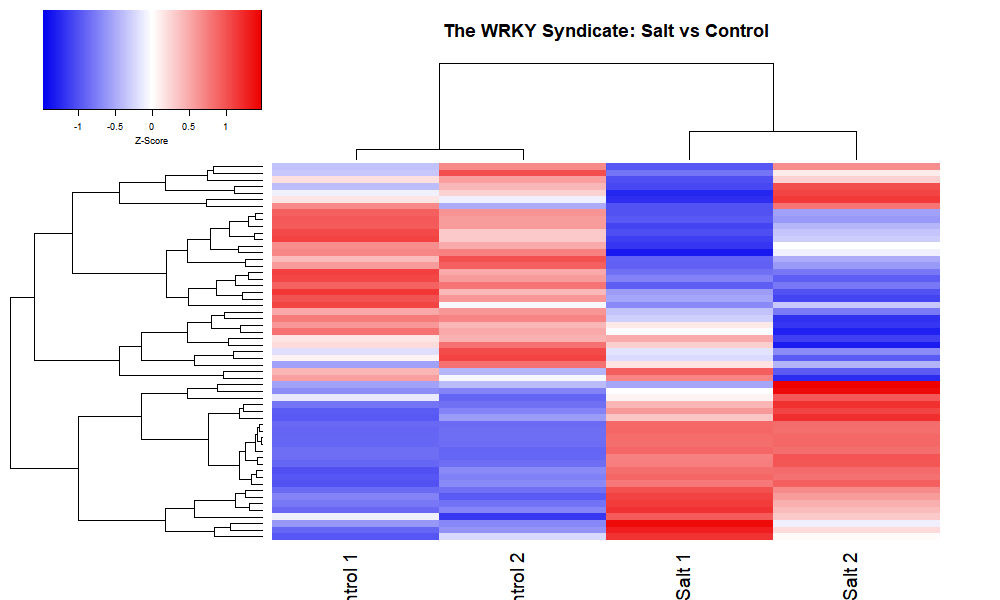

# Transcriptomic Analysis of Salt Stress in Arabidopsis

## 📌 Project Overview
This repository contains a computational pipeline for analyzing **RNA-Seq data** from *Arabidopsis thaliana* exposed to high-salinity stress (150mM NaCl). 

The primary goal was to identify the **"WRKY Syndicate,"** a specific cluster of transcription factors that regulate the downstream stress response, and to visualize global gene expression changes.

## 📂 Repository Structure
arabidopsis-salt-stress/ │ ├── scripts/ │ └── analysis.R # The R script for normalization and DGE analysis │ ├── figures/ │ ├── volcano_plot_salt.png # Visualization of global fold changes │ └── wrky_heatmap.png # Hierarchical clustering of WRKY genes │ └── README.md

## 📊 Key Results

### 1. Global Differential Expression (Volcano Plot)
The analysis identified significantly upregulated and downregulated genes under salt stress.

*Figure 1: Volcano plot showing global gene expression changes. Red points indicate significantly differentially expressed genes (FDR < 0.05, LogFC > 1).*

### 2. The WRKY Syndicate (Heatmap)
Hierarchical clustering revealed a distinct subset of WRKY transcription factors that are strongly induced by salt stress.

*Figure 2: Heatmap of WRKY transcription factors. The "Salt-Responsive Cluster" (Right) shows strong upregulation compared to Control conditions.*

## 🛠️ Methodology & Tech Stack
- **Language:** R (v4.3.0)
- **Libraries:** `edgeR`, `limma`, `gplots`, `RColorBrewer`
- **Normalization:** TMM (Trimmed Mean of M-values) to correct for library size differences.
- **Statistical Test:** Exact Test (Negative Binomial distribution) for differential expression.

## 🧬 Biological Context
Salt stress triggers a Calcium-dependent signaling cascade (SOS pathway). This analysis captures the transcriptional output of that cascade, specifically highlighting the role of **WRKY** and **TCH4** genes in the immediate stress response.

## 👨‍💻 Author
**Anant Kaushal**
*Computational Biologist | Plant Epigenetics Researcher*
